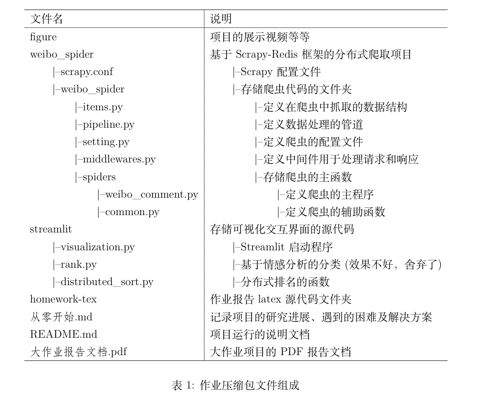
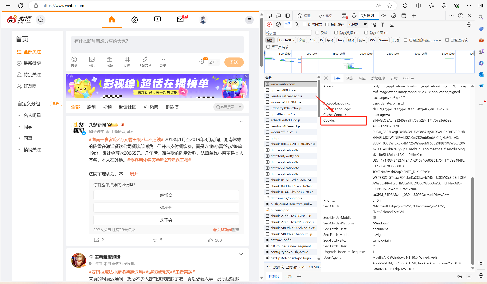
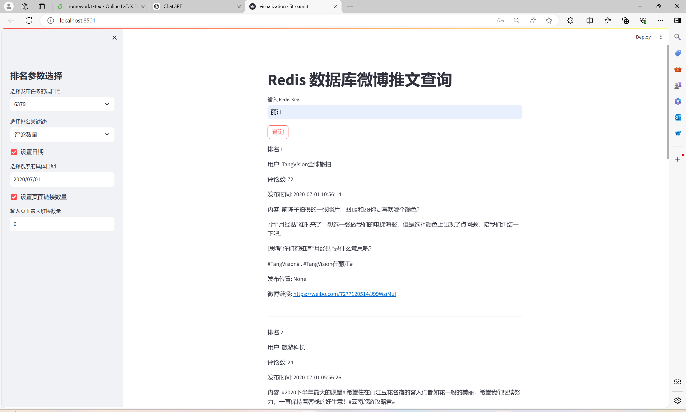

# 基于Scrapy-Redis 的分布式爬虫系统

我们实现的项目是基于Scrapy-Redis 的分布式爬虫系统，主要利用了 Scrapy 框架
与分布式Redis 数据库集群相结合，基于 streamlit 实现了可视化用户交互 Web 界面，旨在为大型、分布式的网络爬虫提供支持以及设计一个对微博推文的排名管理系统。

## 开发环境

操作系统： Windows 11 Version 23H2 

Python 版本： Python 3.11.4

Redis 版本：Redis-x64-5.0.14.1

## 测试运行

### 下载包
使用git命令下载包，安装环境依赖

```shell
git clone https://github.com/SYSU-Zhangyp/Weibo-Comment-Manager-Scrapy-Redis.git
cd weibospider
pip install -r requirements.txt
```



### 替换Cookie

访问[微博电脑端](https://weibo.com/)，登陆账号，打开浏览器的开发者模式，再次刷新



替换 [Settings](./weibo_spider/weibo_spider/settings.py) 中的cookie

### 添加代理IP

重写 [fetch_proxy](./weibo_spider/weibo_spider/middlewares.py) 方法，该方法需要返回一个代理ip

### 部署 Redis 集群

需要部署 Redis-cluster，详细请参考[Redis集群部署教程详解](https://blog.csdn.net/Yel_Liang/article/details/132093594)，集群部署可以参考Redis-cluster文件夹

<div style="display: flex; flex-direction: row;">
    <div style="flex: 50%; padding: 5px;">
        
    </div>
    <div style="flex: 50%; padding: 5px;">
        
    </div>
</div>

### 运行爬虫

开启 Redis 集群，终端执行命令

```shell
cd weibo_spider
scrapy crawl weibo_comment
```

等待请求队列生成，等待终端爬取结果输出

### 可视化 Redis 数据库

下载安装 Redis Desktop Manager


### 评论查询平台

返回上一目录，运行 streamlit，实现用户交互

```shell
cd ..
cd streamlit
streamlit run visualization.py
```

## 结果展示




